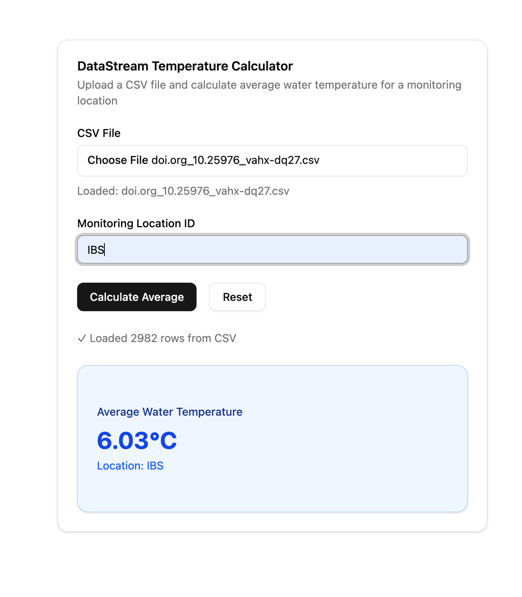

## DataStream CSV Water Temperature Calculator 
A client-side CSV parser that calculates the average water temperature given a monitoring location and CSV file.

## Demo 


##  Technical Implementation
- **Framework**: SvelteKit
- **CSV Parsing**: Papa Parse
- **Styling**: TailwindCSS, shadcn-svelte


## Developing
```sh
pnpm install

pnpm run dev
```

## Testing 

```sh
pnpm run test
```

## Building

To create a production version of the app:

```sh
pnpm run build
```
